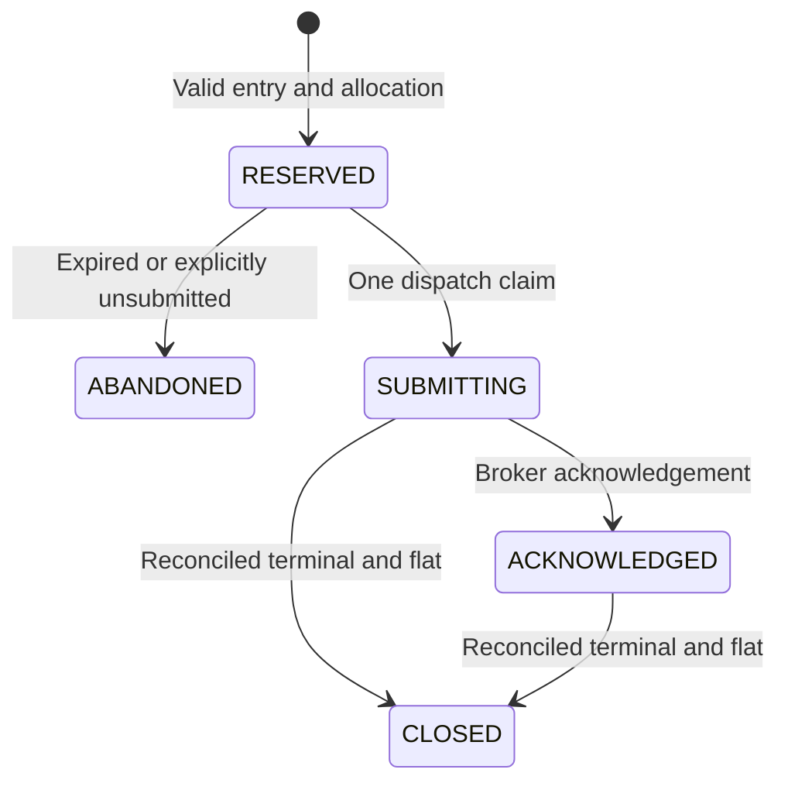

# Durable controller admission foundation

`app.asset_modules.admission_controller.PaperAdmissionController` is an isolated,
PAPER-only allocation/command ledger for the forthcoming engine process split.
It is **not wired into desktop composition**, has no broker imports or calls,
and changes no current Warrior, Scalper or crypto trading behavior. Constructing
it creates only its explicitly chosen controller database; it does not open or
modify Atlas's existing paper execution, research or observation databases
automatically. Use a dedicated new path, never one of those existing databases.

## Protocol

1. Configure an explicit shared account allocation (capital and total planned
   loss budget). It is not a substitute for current broker buying power or risk.
2. A trusted adapter creates an immutable entry reservation with command ID,
   account, engine, lifecycle, canonical instrument ID, policy version, side,
   quantity, limit, structural stop, multiplier, capital and loss budget. Include
   fresh quote and entry expiry timestamps. Do not construct this directly from
   unchecked AI JSON.
3. `reserve` uses a SQLite `BEGIN IMMEDIATE` transaction. It checks shared
   account allocation, exclusive instrument ownership and command identity.
   Exact repeated requests reuse their state; changing a reused ID fails.
4. Immediately before submission, the trusted adapter must recheck the broker
   account, quote, halt/session, executable setup, protection plan and existing
   risk gates. `claim_dispatch` returns true only once and rechecks quote age and
   expiry. No broker calls occur while the SQLite transaction is held.
5. A broker acknowledgement retains the reservation. Position/order management
   remains the owning engine's responsibility and does not depend on AI.
6. Only authoritative reconciliation showing terminal orders **and zero remaining
   lifecycle quantity** releases a submitted reservation. An unclaimed command
   can be abandoned without broker reconciliation.

A crash, timeout, AI failure or engine restart after dispatch cannot prove the
broker did not receive an order. SUBMITTING remains uncertain and retains its
allocation, including across controller restart. Never retry it blindly. Later
execution integration requires the broker's client-order idempotency and a
reconciler able to find the original command. This ledger supplies a single
dispatch claim, **not exactly-once broker execution**.
`recovery_commands` provides account-scoped, bounded pages of pending command
payloads and broker order IDs for the trusted reconciler. The future IPC layer
must bind each engine identity to its worker; an identity inside model output
is not authentication.

## Integration limits

- The current version reserves full limit-price notional for every instrument.
  Planned price risk uses the instrument multiplier. Declare fees/cost allowances
  in addition to these minimums. Margin-based futures/short-option sizing is not
  implemented and must use verified broker contract/margin data in a later stage.
- Instrument identity must be canonical and uppercase. An options/futures ID
  must identify a contract, not only an underlying symbol. Resolving aliases,
  expiry and multipliers remains the trusted adapter's job.
- All workers sharing an account must use the same controller DB/allocation.
  Separate crypto simulator cash is not automatically combined with equity cash.
  Monetary inputs must share the account's currency; currency conversion and
  contract lot-size validation belong to the trusted adapter, not the model.
- Existing open positions must be reconciled and adopted before entry routing
  can be switched to this controller. Never begin with an empty allocation ledger
  while an account already has exposure.
- No exits are routed through the entry budget gate. The future dispatcher must
  validate exit ownership/quantity independently and keep protective exits
  available when new entries or AI proposals are disabled.
- Account allocations are immutable after configuration in this first version;
  there is no model-facing risk-edit API. No AI provider or model is selected here.
- Terminal IDs are retained. Reservations do not expire automatically after
  dispatch, and no history or Atlas data is deleted.
- The loss budget is planned structural-stop risk, not a guaranteed maximum
  loss; adverse gaps and execution costs can exceed it. Monetary values support
  at most eight fractional places and 24 significant digits. At most 1,000
  active reservations per account are admitted in this initial implementation.

Tests cover independent spawned workers sharing one DB, concurrent dispatch
claims, duplicate identity, quote age/expiry, lifecycle ownership, allocation
limits, partial exposure preventing release and recovery after uncertain
submission. These are coordination tests, not trading-performance tests.

Next integrate the reconciler and broker adapter in PAPER, then migrate engine
workers behind this protocol. AI can propose strategy actions and policy versions;
the trusted deterministic path owns admission, submission and protection.
